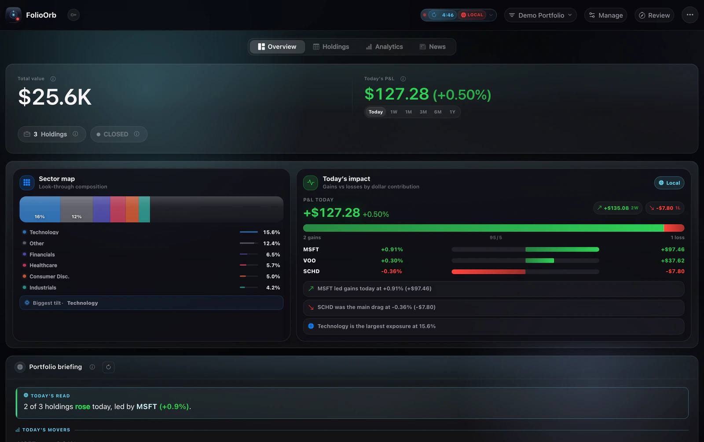
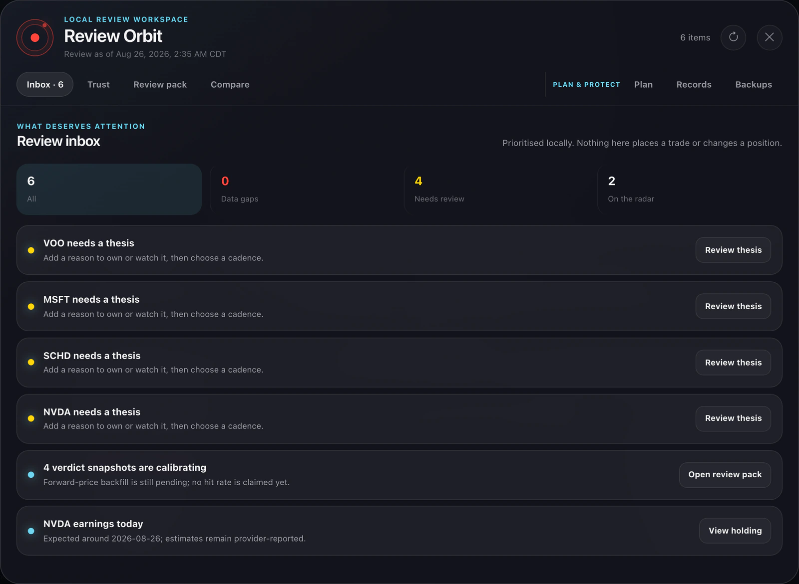
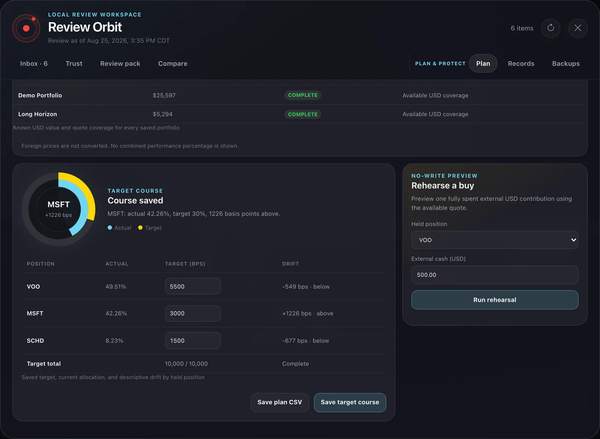

<p align="center">
  <picture>
    <source media="(prefers-color-scheme: dark)" srcset="static/img/brand/folio-orbit-mark-light-animated.svg">
    <source media="(prefers-color-scheme: light)" srcset="static/img/brand/folio-orbit-mark-dark-animated.svg">
    
  </picture>
</p>

<h1 align="center">FolioOrb</h1>

<p align="center"><strong>See what changed. Decide what deserves attention. Keep the record.</strong></p>

<p align="center">
  FolioOrb is a local-first portfolio review dashboard for people who want the reasoning behind
  the number. It turns holdings, public market context, risk, news, and optional Claude narration
  into an explainable review loop—without a FolioOrb account, cloud sync, telemetry, brokerage
  connection, or automatic trades.
</p>

<p align="center">
  <a href="https://github.com/udhawan97/FolioOrb/releases/latest"><strong>Download the latest stable release</strong></a>
  · <a href="https://udhawan97.github.io/FolioOrb/"><strong>Explore FolioOrb</strong></a>
  · <a href="https://udhawan97.github.io/FolioOrb/get-started/introduction/"><strong>Read the docs</strong></a>
</p>

<p align="center">
  <a href="https://github.com/udhawan97/FolioOrb/releases/latest"></a>
  <a href="https://github.com/udhawan97/FolioOrb/actions/workflows/ci.yml"></a>
  
  <a href="LICENSE"></a>
</p>

---

## Run it your way

The desktop and browser paths run the same FastAPI + SQLite dashboard on your machine.

| Path | Supported systems | What you need | Start here |
| --- | --- | --- | --- |
| **macOS desktop** | Apple Silicon · macOS 11+ | Nothing else | [Latest `.dmg`](https://github.com/udhawan97/FolioOrb/releases/latest) · [Install guide](https://udhawan97.github.io/FolioOrb/install-macos/) |
| **Windows desktop** | x64 · Windows 10/11 | WebView2 if Windows asks for it | [Latest `.exe`](https://github.com/udhawan97/FolioOrb/releases/latest) · [Install guide](https://udhawan97.github.io/FolioOrb/install-windows/) |
| **Local browser app** | macOS · Windows · Linux | Python 3.11+ | [Build from source](https://udhawan97.github.io/FolioOrb/build-from-source/) |

> [!IMPORTANT]
> Desktop builds are not Developer ID/notarization or Authenticode signed yet. macOS and Windows
> show a first-launch warning. Download only from the official release page and compare the file
> with the included `SHA256SUMS.txt`; current releases provide checksum integrity, not a Minisign
> authenticity signature.

## One review loop

1. **Add holdings or research ideas.** Type them in, use the strict local CSV template, or ask
   Claude to map a bounded sample from a messy export. Research-only rows stay outside portfolio
   math until shares are added.
2. **Read the whole picture.** FolioOrb combines usable USD quotes, cost basis, allocation,
   concentration, risk, filings, dividends, and news. Missing, stale, foreign-currency, or partial
   inputs stay visible instead of turning into confident zeroes.
3. **Review what needs attention.** Review Orbit separates data gaps, thesis work, reminders,
   comparison, target planning, and read-only buy rehearsal. Nothing in the workspace places a
   trade or changes a position by itself.
4. **Keep the evidence.** Save review HTML/CSV, a data-health receipt, target snapshot, annual
   realized-sales recap, readable records ZIP, verified SQLite backup, or one checksummed review
   bundle.

<p align="center">
  
  <br>
  <sub>The current dashboard with fictional demo holdings. Values are illustrative; missing data remains explicit.</sub>
</p>

## What FolioOrb helps you answer

| Question | FolioOrb surface |
| --- | --- |
| **What changed today?** | Known USD value, daily contribution, movers, portfolio briefing, and source freshness |
| **What am I actually exposed to?** | Allocation, sector tilt, overlap, concentration, beta, drawdown, volatility, and benchmark context |
| **What deserves attention?** | Filterable Review Inbox, thesis cadence, data-health coverage, verdict calibration, and upcoming events |
| **What course did I choose?** | Exact basis-point targets, target-versus-actual drift, quote exclusions, and read-only buy rehearsal |
| **What can I carry forward?** | Review packs, receipts, snapshots, readable records, sale recaps, verified backups, and review bundles |

<p align="center">
  
  <br>
  <sub>Filters change the view, not the underlying queue. The total stays visible.</sub>
</p>

<p align="center">
  
  <br>
  <sub>Planning is descriptive and local. Missing quotes remain exclusions; rehearsals never place orders.</sub>
</p>

## Local-first, with exact boundaries

| Stays on your machine | Leaves only for a named job | FolioOrb never does |
| --- | --- | --- |
| Holdings, shares, costs, notes, thesis text, snapshots, backups, settings, generated receipts, and cached summaries | Tickers/date ranges to public market and filing providers; release checks to GitHub; bounded derived context to Claude only for Claude-backed actions | Connect to a brokerage, place a trade, upload the SQLite database, add telemetry, convert foreign quotes into USD, or hide missing data behind zero |

Claude is optional. Local Intelligence owns deterministic verdicts, portfolio math, scenarios, and
review prioritization. When a key is configured, FolioOrb performs credential-only availability
checks and can send bounded derived context for the Claude actions you invoke. The precise provider
and prompt boundaries are documented in [Privacy & Data Handling](https://udhawan97.github.io/FolioOrb/privacy/).

## Install

<details open>
<summary><strong>Run from source in your browser</strong></summary>

Requires Python 3.11+:

```bash
git clone https://github.com/udhawan97/FolioOrb.git
cd FolioOrb
./scripts/setup.sh
```

Windows PowerShell:

```powershell
git clone https://github.com/udhawan97/FolioOrb.git
cd FolioOrb
.\scripts\setup.ps1
```

The setup script creates a virtual environment, installs dependencies, prepares a local profile,
and starts FolioOrb at <http://localhost:8000>. Later launches use `./scripts/start.sh` or
`.\scripts\start.ps1`.

</details>

<details>
<summary><strong>Install the desktop app</strong></summary>

- **macOS Apple Silicon:** open the latest `.dmg`, drag FolioOrb to Applications, then follow the
  [Gatekeeper steps](https://udhawan97.github.io/FolioOrb/install-macos/).
- **Windows x64:** run the latest setup `.exe`, allow WebView2 if requested, then follow the
  [SmartScreen steps](https://udhawan97.github.io/FolioOrb/install-windows/).

The app stores its writable profile outside the installed bundle, so reinstalling or updating the
program does not intentionally replace the portfolio database or `.env`.

</details>

<details>
<summary><strong>Use the one-line source installer</strong></summary>

Read the scripts first: [macOS/Linux](scripts/install-mac.sh) · [Windows](scripts/install-win.ps1).

```bash
curl -fsSL https://raw.githubusercontent.com/udhawan97/FolioOrb/main/scripts/install-mac.sh | bash
```

```powershell
irm https://raw.githubusercontent.com/udhawan97/FolioOrb/main/scripts/install-win.ps1 | iex
```

Set `FOLIO_REF` to pin a stable tag from `v5.16.0` onward or use the `latest-main`
development channel.
One-line installs keep SQLite, `.env`, backups, settings, and update state in a durable per-user
profile outside the replaceable source tree. The first upgrade from an older layout performs a
verified migration and retains the prior install as a recovery copy.

</details>

## Updates, backups, and recovery

- The desktop app checks GitHub for updates and installs only after you approve.
- A verified safety backup is required before an update, migration, restore, or duplicate-row
  recovery changes the active database.
- Custom profiles must keep `DATABASE_URL` inside `FOLIOORB_DATA_DIR`; split profiles fail before
  FolioOrb creates writable state.
- Automatic backups are opt-in. Manual, update, restore, and automatic snapshots remain local.
- Duplicate active ticker rows are never guessed between. The recovery window shows every stored
  field, requires one explicit keeper per group, archives the other active rows, and records no sale.

See [Updating](https://udhawan97.github.io/FolioOrb/updating/),
[Review Orbit](https://udhawan97.github.io/FolioOrb/dashboard/review-orbit/), and
[Troubleshooting](https://udhawan97.github.io/FolioOrb/troubleshooting/) for the complete workflows.

## Limitations worth knowing

- Desktop installers are currently unsigned; checksum verification is available on every release.
- The packaged macOS build is Apple Silicon only. Intel macOS and Linux use the source path.
- Portfolio totals are USD-only. Foreign-currency quotes are named and excluded; FolioOrb has no
  FX conversion path.
- Realized sales use stored average cost. FolioOrb is not tax-lot or tax-filing software.
- Provider data can be delayed, partial, revised, or unavailable. FolioOrb labels those conditions
  and keeps last-known values when appropriate.
- FolioOrb is an analysis and record-keeping tool, not financial advice or an execution platform.

## For developers

```bash
source venv/bin/activate
python -m compileall -q app run.py tests
ANTHROPIC_API_KEY= python -m pytest -q
python -m pylint $(git ls-files '*.py')
```

Frontend behavior is plain JavaScript and its runtime contracts run with Node:

```bash
node --test tests/js/*.test.cjs
```

| Area | Owner |
| --- | --- |
| `app/routers/` | FastAPI request boundaries |
| `app/services/` | Portfolio, provider, review, backup, and update behavior |
| `static/` + `templates/` | Dashboard UI |
| `desktop/` + `packaging/` | Frozen desktop entry points and installers |
| `docs-site/` | Astro/Starlight website and docs |

Start with [CLAUDE.md](CLAUDE.md) for repository contracts and
[Architecture](https://udhawan97.github.io/FolioOrb/architecture/) for the system map.

## Release channels

- **Stable:** versioned tags such as `v5.16.1`; used by the latest stable release link.
- **latest-main:** rolling prerelease built from current `main`; useful for testing, never promoted
  as the stable download automatically. [Open the development build](https://github.com/udhawan97/FolioOrb/releases/tag/latest-main).

Every channel builds macOS and Windows artifacts on native hosted runners, exercises frozen smoke
tests, and publishes `SHA256SUMS.txt` only after both platform builds pass.

## License

Apache License 2.0. See [LICENSE](LICENSE).
